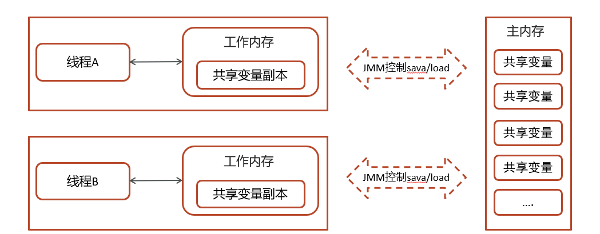

# 谈谈JMM(java内存模型)

## 笔记和理解

### 什么是java内存模型？

>定义了共享内存中的多线程程序读写操作的行为规范，这些规则来规范对内存的读写操作从而保证指令的正确性
>
>
>
>在下述内存中
>
>工作内存是独属于每个线程的私有内存，不会出现线程安全问题
>
>主内存包含共享变量，包含成员变量，实例对象，数组，每个线程均可访问，就会出现线程安全问题

>多个线程需要通过主内存实现数据同步

### 谈谈

>JMM将内存分为私有线程的工作内存和所有线程共享的主内存，两者分开
>
>线程与线程间是相互隔离的，它们间的交互需要主内存协助