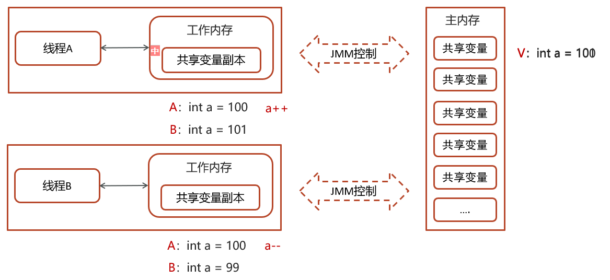
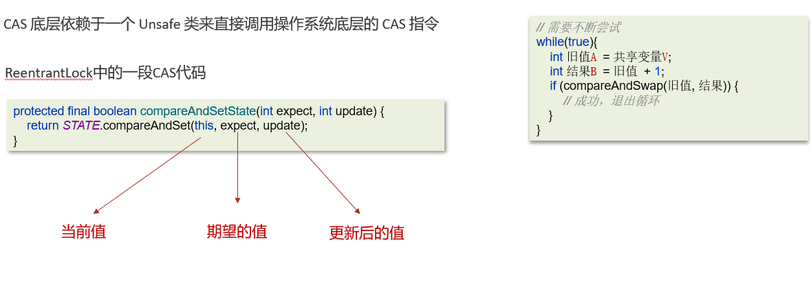
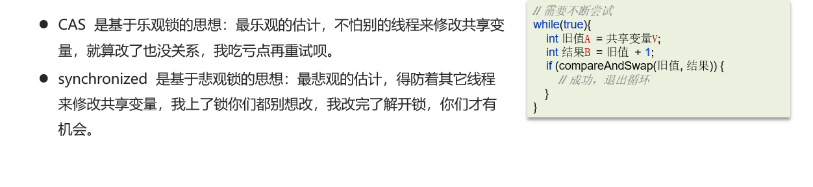
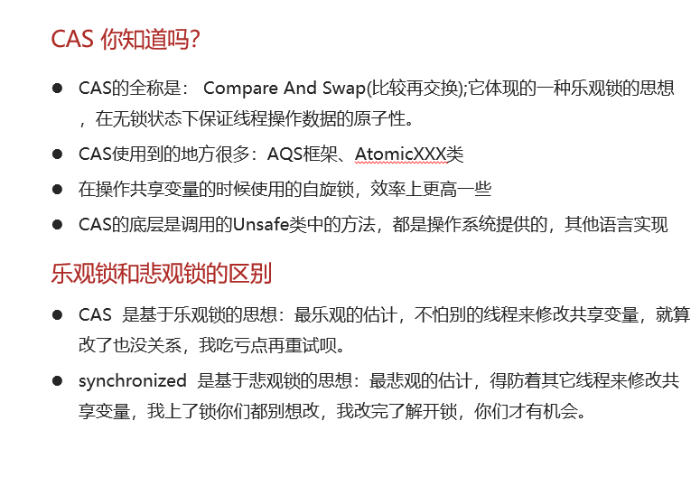

# CAS的原理

## 笔记和理解

### CAS

>CAS全称 compare and swap(比较再交换)，它体现的是一种乐观锁的思想，在无锁情况下保证线程操作共享数据的原子性
>
>在JUC(java.util.concurrent)包下实现的很多类都用到了CAS操作比如AQS框架，AtomicXXX类

### CAS交换数据的流程

>一个当前内存值V，旧的预期值A、即将更新的值B，当且仅当旧的预期值A和内存值V相同时，将内存值修改为B并返回true，否则什么都不做，并返回false。如果CAS操作失败，通过自旋的方式等待并再次尝试，直到成功
>
>
>
>流程如下：
>
>线程A和线程B读取主内存的数据a，首先由线程A想要数据a++，而线程B想要数据a--，因此它们都自己进行自己的操作就导致了线程不安全，因此使用了CAS，即比较后交换，在进行数据操作前先与主内存数据进行比较，若工作内存的数据和主内存的数据相同则可以更改数据为101，但线程B进行比较时发现数据100和101不对等，因此会先从主内存读取一次数据后，再更新数据

>CAS使用的是乐观锁，因此不会真正的枷锁，线程就不会陷入阻塞，效率较高
>
>如果竞争激烈，重试频繁发生，效率会受到影响

### CAS底层实现

### 乐观锁和悲观锁

### 总结

