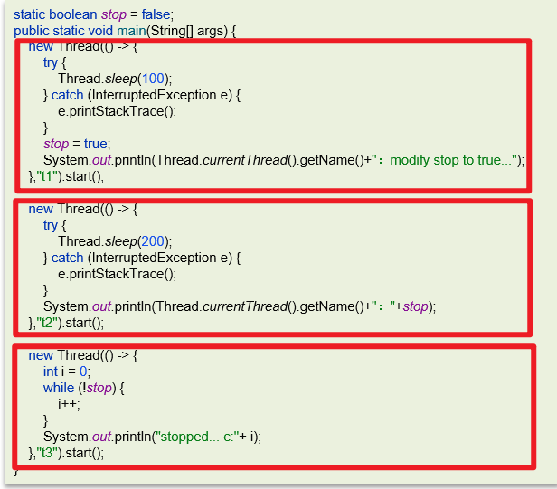
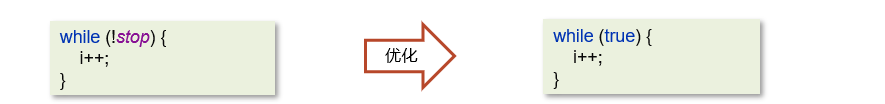

# 谈谈对volatile的理解

## 笔记和理解

## 一

>一旦一个共享变量（类的成员变量、类的静态成员）被volatile修饰之后，就会出现两层语义
>
>① 保证线程间的可见性
>
>② 禁止进行指令重排序

####  保证线程间的可见性

>使用volatile修饰一个共享变量，可以防止编译器等的优化发生，保证一个线程对共享变量的修改能够被另外一个线程可见

>代码如下
>
>代码有三个线程，线程1会在线程2打印stop值之前完成对stop这个共享变量的修改，如果这个共享变量再线程间可见，那么，stop在线程1中被修改，那么线程2就是true（因为强制读取了主内存变量值），同时线程3也不会进入死循环；反之，没有使用volatile进行修饰，那么该共享变量不可见，即线程1完成修改，线程2也能看出修改为true，但是线程3会进入死循环

**问题分析：**出现这个问题的原因是JVM虚拟机中有个JIT（即时编译器）给代码做出了优化

>就像下面，将!stop直接优化成了true

>解决方法：
>
>* 方法1 在程序运行时加入vm参数 -Xint表示禁止使用即时编译器，不推荐使用，得不偿失
>* 方法2 就在共享变量前面添加volatile参数，那么相当于告诉jit，不要对volatile修饰的变量进行优化

#### 禁止指令重排序