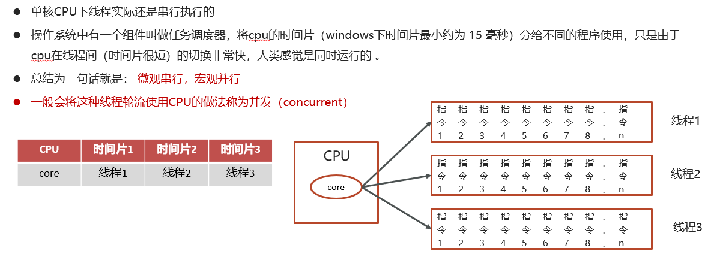
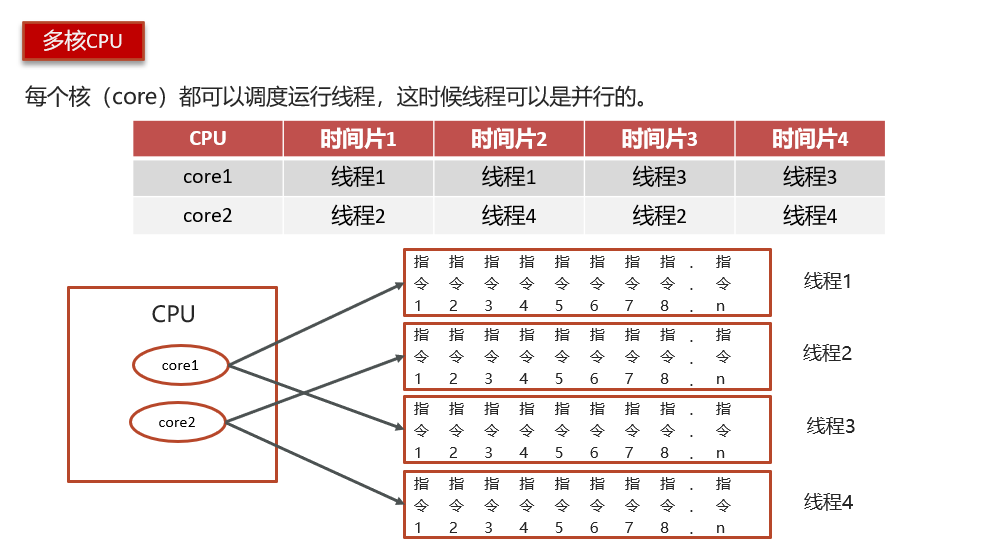
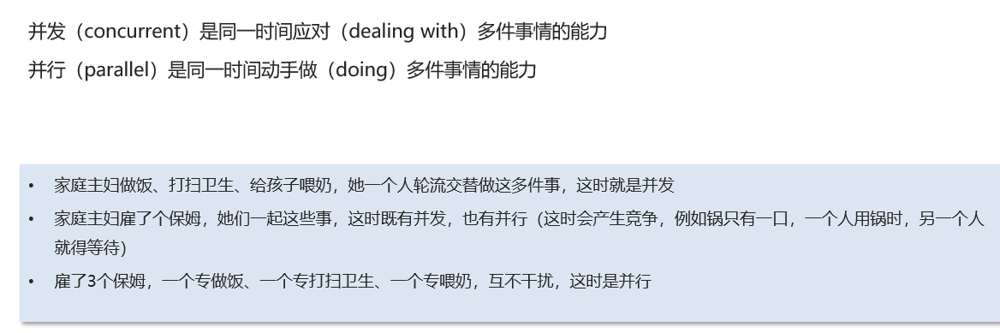

# 并行和并发的区别

## 笔记和理解

### 并发和并行的区别？

#### 单核CPU

>在单核CPU下，多线程任务仍然是串行执行的，但操作系统有个任务调度器组件，将CPU的时间片分给不同程序使用，一个时间片很短，因此切换非常快，感知下会觉得是同时运行的。因此在微观下是串行，宏观就是并行，我们将线程轮流使用CPU的做法称为并发

#### 多核CPU

>每个核都会调度运行线程，这时线程是真正的并行

#### 总结

>并发，就是多个任务的执行需要抢夺资源，谁抢到资源谁就执行，但中间资源可以被抢夺，然后就会发生任务切换，在宏观层面看就是并行。并行，多个任务同时进行，资源充足，不会发生抢夺

