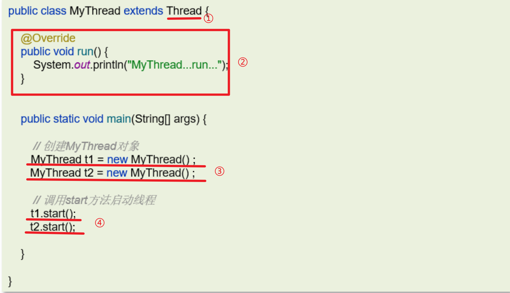
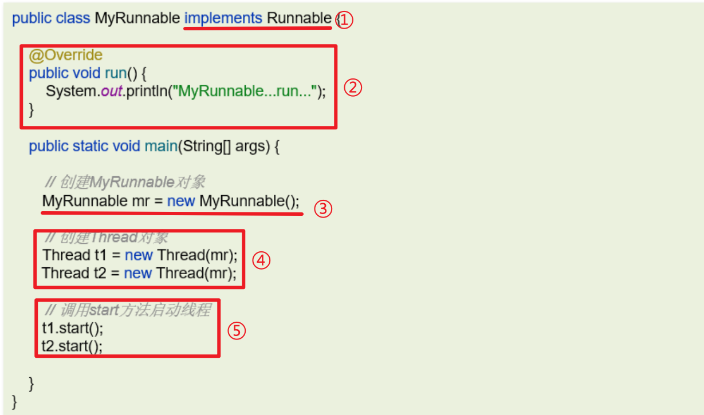
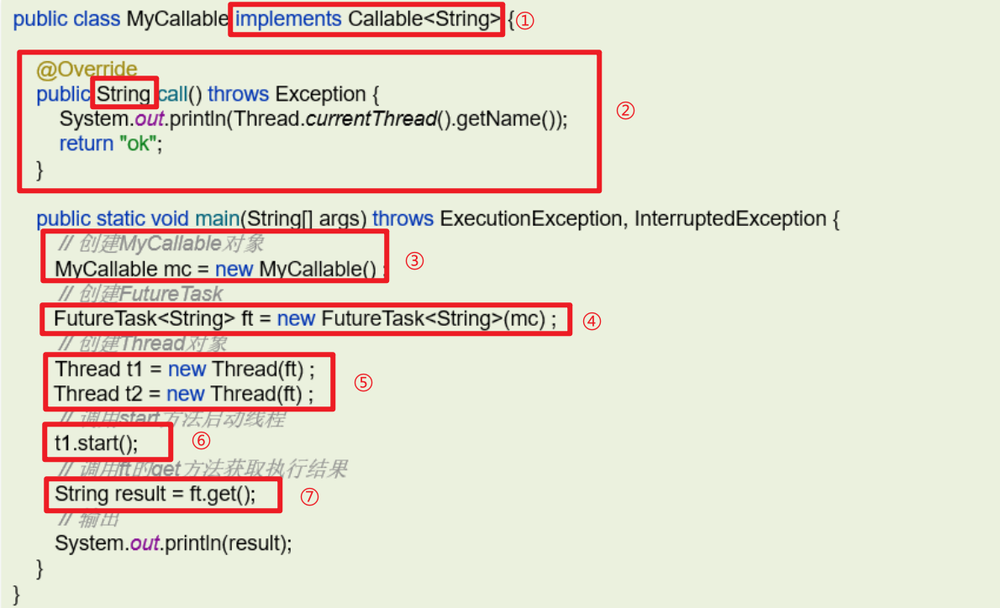
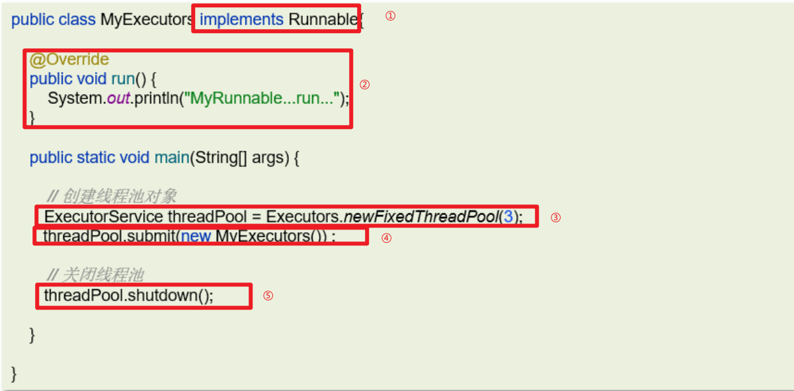

# 线程的创建方式

## 笔记和理解

### 线程的创建方式

#### 继承Thread类

>基本步骤：
>
>①：继承Thread类
>
>②：重写run方法
>
>③：new对象，创建线程1，2...
>
>④：调用每个线程的start方法

#### 实现Runable接口

>基本步骤：
>
>①：实现Runable接口
>
>②：重写run方法
>
>③：创建实例，相当于构筑一辆车
>
>④：由Threa来提供线程可以跑的公路
>
>⑤：使用线程的start方法启动线程

#### 实现Callable接口（回调）

>基本步骤：
>
>①：实现Callable接口，并提供泛型类型，这个泛型用于对照返回值的类型
>
>②：重写call方法，其中返回值对应泛型，call方法相当于给发动机装了一个反馈接口
>
>③：实例化一个对象
>
>④：使用Future或FutureTask包装对象，即发动机和汽车壳组合
>
>⑤：由Thread实例提供马路
>
>⑥：启动Thread的马路，可以让车跑起来
>
>⑦：调用汽车提供的方法get来获得汽车使用反馈

#### 线程池创建线程

>基本步骤：
>
>①：实现Runable类
>
>②：重写Run方法
>
>③：创建线程池
>
>④：在线程池中提交线程任务，执行线程
>
>⑤：关闭线程池

### Runable和Callable的区别

>Runable的run方法没有返回值；而Callable的call方法有返回值，可以由Future或FutureTask类调用后get得到线程执行后返回的结果
>
>Runable的run方法不能向外抛出异常，只能内部解决；Callable的call方法可以抛出异常

### run方法和start方法的区别

>在继承Thread类的实例，不仅可以使用start方法也可以使用run方法，其中run方法可以多次调用，但start不行。start方法用于启动线程，一个实例只能用一次，该方法调用run方法所定义的逻辑。而run方法封装了要执行的线程代码，可被调用多次