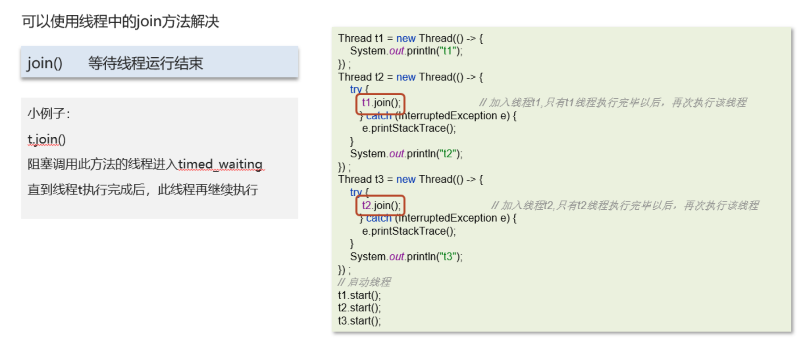

# 新建T1，T2，T3线程，保证他们的顺序执行

## 笔记和理解

### 保证顺序执行的方法

>可以使用Thread.join()方法。
>
>join方法的解释就是阻塞当前调用该线程A的线程B，直到 线程A.join()的线程A结束，再启动线程B

这里有些问题，就是这里使用了Lambda，所以不好得出拆开写会出现什么情况——》结论：不行

### notify和notifyAll的区别

>调用notify()方法会随机唤醒一个等待的线程
>
>调用notifyAll()方法会唤醒所有等待线程，先后随机唤醒