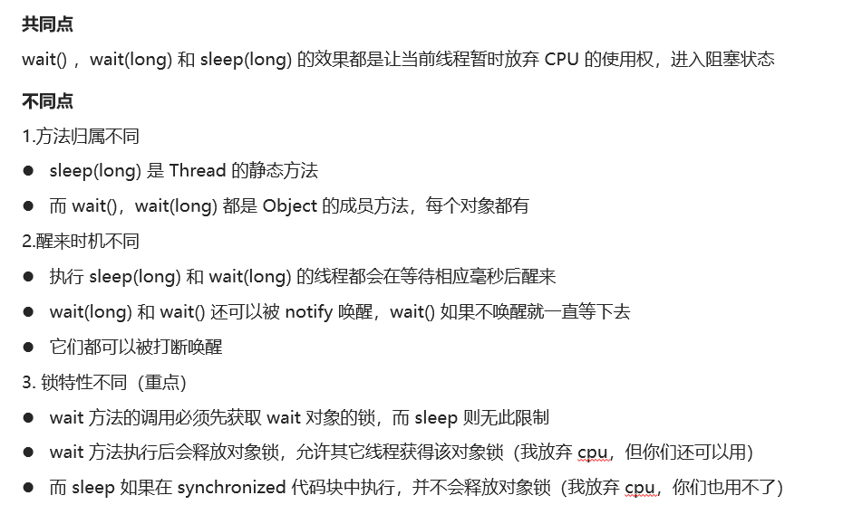

# wait方法和sleep方法的区别

## 笔记和理解

### 在java中wait和sleep方法的不同和相同

>**相同点**
>
>wait()、wait(long)、sleep(long)的效果都是让当前线程放弃CPU的使用权，进入阻塞状态，但都可被notify()唤醒
>
>**不同点**
>
>1.归属不同：
>
>* sleep(long) 是Thread的静态方法
>* wait()和wait(long) 是 Object类的成员方法，每个对象都有
>
>2.醒来时间不同
>
>* 执行sleep(long)和wait(long)的线程都会在等待响应毫秒醒来
>* 而wait()则会一直等待，除非notify醒来
>
>3.特性不同
>
>* wait方法调用需要先获取wait对象的锁，即synchronized(对象)，而sleep无限制
>* wai方法执行后会释放对象锁，允许其它线程获取使用，而sleep方法在synchronized里使用则不会释放

