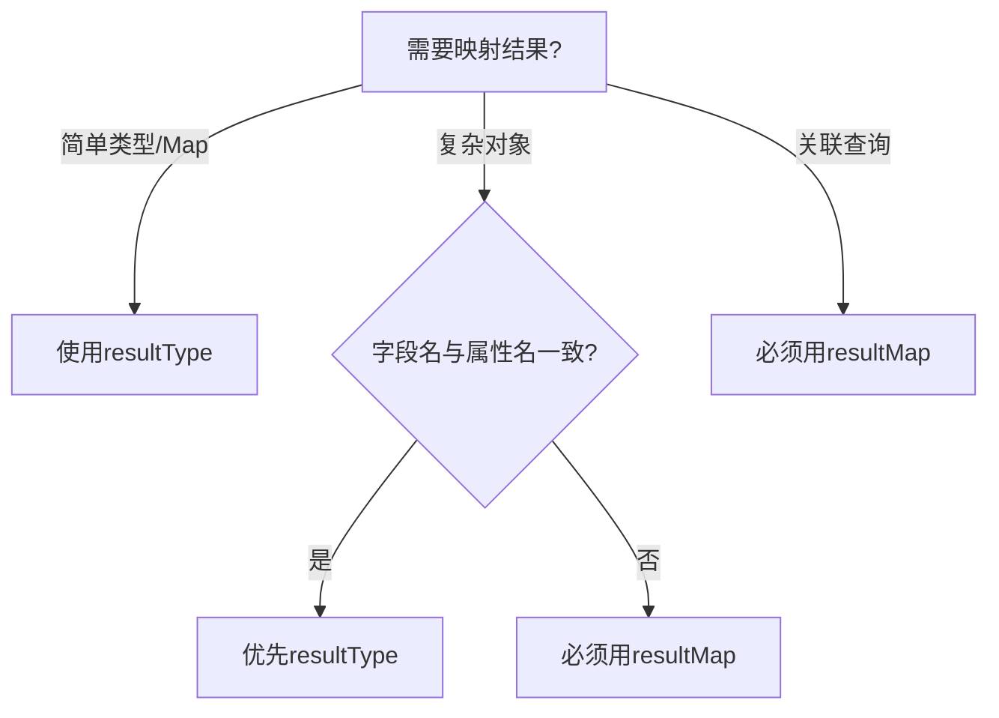

# MyBatis 中 `<resultMap>` 与 `<select>` 的深度联动解析

---

## 一、`<resultMap>` 核心架构剖析

### 1. 基础结构
```xml
<resultMap id="唯一标识" type="目标Java类型">
    <!-- 主键映射 -->
    <id property="对象属性" column="数据库字段"/>
    
    <!-- 普通字段映射 -->
    <result property="对象属性" column="数据库字段"/>
    
    <!-- 一对一关联 -->
    <association property="对象属性" javaType="关联对象类型">
        <!-- 嵌套映射 -->
    </association>
    
    <!-- 一对多关联 -->
    <collection property="集合属性" ofType="集合元素类型">
        <!-- 嵌套映射 -->
    </collection>
</resultMap>
```

### 2. 与 `<select>` 的联动原理


---

## 二、基础映射场景对比

### 场景1：字段名与属性名完全一致
```xml
<!-- 使用 resultType -->
<select id="getUser" resultType="User">
    SELECT user_id, user_name, user_email FROM t_user
</select>

<!-- 等效的隐式 resultMap -->
<resultMap id="autoMap" type="User">
    <result column="user_id" property="userId"/>
    <result column="user_name" property="userName"/>
    <result column="user_email" property="userEmail"/>
</resultMap>
```

### 场景2：字段名与属性名不一致
```xml
<!-- 显示定义 resultMap -->
<resultMap id="explicitMap" type="User">
    <id column="uid" property="id"/>
    <result column="uname" property="name"/>
    <result column="uemail" property="email"/>
</resultMap>

<!-- 在 select 中引用 -->
<select id="getSpecialUser" resultMap="explicitMap">
    SELECT uid, uname, uemail FROM special_user
</select>
```

---

## 三、复杂关系映射实战

### 案例：用户档案系统
```java
// 领域模型
public class User {
    private Integer id;
    private String name;
    private Profile profile;      // 一对一
    private List<Order> orders;   // 一对多
}

public class Profile {
    private String realName;
    private String idCard;
}

public class Order {
    private String orderNo;
    private BigDecimal amount;
}
```

### 1. 完整映射配置
```xml
<resultMap id="fullUserMap" type="User">
    <!-- 基础字段 -->
    <id column="user_id" property="id"/>
    <result column="user_name" property="name"/>
    
    <!-- 一对一映射 -->
    <association property="profile" javaType="Profile">
        <result column="real_name" property="realName"/>
        <result column="id_card" property="idCard"/>
    </association>
    
    <!-- 一对多映射 -->
    <collection property="orders" ofType="Order">
        <id column="order_id" property="id"/>
        <result column="order_no" property="orderNo"/>
        <result column="amount" property="amount"/>
    </collection>
</resultMap>
```

### 2. 关联查询语句
```xml
<select id="getFullUser" resultMap="fullUserMap">
    SELECT 
        u.id AS user_id,
        u.name AS user_name,
        p.real_name,
        p.id_card,
        o.id AS order_id,
        o.order_no,
        o.amount
    FROM users u
    LEFT JOIN profiles p ON u.id = p.user_id
    LEFT JOIN orders o ON u.id = o.user_id
    WHERE u.id = #{userId}
</select>
```

---

## 四、高级映射技巧

### 1. 继承映射（类似OOP）
```xml
<!-- 基础映射 -->
<resultMap id="baseUserMap" type="User">
    <id column="id" property="id"/>
    <result column="name" property="name"/>
</resultMap>

<!-- 扩展映射 -->
<resultMap id="extUserMap" extends="baseUserMap">
    <result column="age" property="age"/>
    <association property="profile" resultMap="profileMap"/>
</resultMap>
```

### 2. 自动映射辅助
```xml
<!-- 开启自动驼峰映射 -->
<settings>
    <setting name="mapUnderscoreToCamelCase" value="true"/>
</settings>

<!-- 混合使用自动映射+显式配置 -->
<resultMap id="hybridMap" type="User" autoMapping="true">
    <id column="special_id" property="id"/> <!-- 特殊字段显式映射 -->
</resultMap>
```

---

## 五、`resultType` vs `resultMap` 决策树



---

## 六、最佳实践示例

### 场景：多表联合查询
```sql
-- 数据库结构
users (id, name, dept_id)
departments (id, dept_name)
```

```xml
<!-- 结果映射 -->
<resultMap id="userWithDeptMap" type="User">
    <id property="id" column="user_id"/>
    <result property="name" column="user_name"/>
    <association property="department" javaType="Department">
        <id property="id" column="dept_id"/>
        <result property="name" column="dept_name"/>
    </association>
</resultMap>

<!-- 查询语句 -->
<select id="getUserWithDepartment" resultMap="userWithDeptMap">
    SELECT 
        u.id AS user_id,
        u.name AS user_name,
        d.id AS dept_id,
        d.name AS dept_name
    FROM users u
    JOIN departments d ON u.dept_id = d.id
    WHERE u.id = #{userId}
</select>
```

---

## 七、常见问题排查

### 问题1：字段映射失效
**现象**：查询结果部分字段为null  
**排查步骤**：
1. 检查`resultMap`的`property`和`column`拼写
2. 确认数据库字段是否真的返回了数据
3. 查看SQL日志确认实际执行的SQL

### 问题2：N+1查询问题
**现象**：关联查询产生大量额外SQL  
**解决方案**：使用`<association>`的`columnPrefix`特性
```xml
<resultMap id="smartMap" type="User">
    <association property="profile" 
                 resultMap="profileMap" 
                 columnPrefix="prof_"/>
</resultMap>

<!-- 查询时使用别名前缀 -->
<select id="getUsers" resultMap="smartMap">
    SELECT 
        u.*,
        p.name AS prof_name,
        p.age AS prof_age
    FROM users u
    LEFT JOIN profiles p ON u.profile_id = p.id
</select>
```

---

通过这种深度整合的示例解析，您可以：
1. 掌握`resultMap`与`select`的协作机制
2. 灵活处理简单到复杂的各种映射场景
3. 避免常见的映射配置陷阱
4. 构建可维护性高的映射配置体系